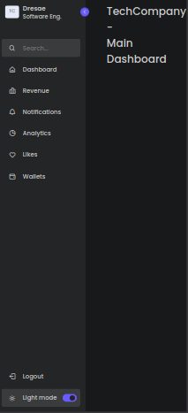

#  MODERN AND RESPONSIVE SIDEBAR WITH DARK MODE
## OVERVIEW
overview of the project with core features and functionalities





***
## ARCHITECTURE
Explains how the code is structured in a high level format

***
## CODE ANALYSIS
- Lists the main functionalities of the project
- Gives a lower level explanation of each main code blocks so the reader can understand its usability and importance.
- Start with the HTML, CCS and later with the Javascript functions/Objects.

##  HTML File
###  Summary:

Explanation codeblock 1

    ```
    codeblock1 here{
    }
    ```
Explanation code block 2

    ```
    code block2 here{
    }
    ```
    
##  CSS File
###  Summary:
Explanation codeblock 1

    ```
    codeblock1 here{
    }
    ```
Explanation code block 2

    ```
    code block2 here{
    }

## JS File
### Summary:

Explanation codeblock 1

    ```
    codeblock1 here{
    }
    ```
Explanation code block 2

    ```
    code block2 here{
    }

***


***
