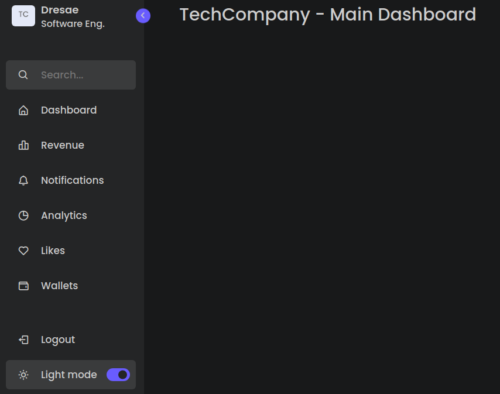

#  Modern and Responsive Sidebar With Dark Mode :bike:

## Overview :scroll:
Modern sidebar design integrated with a clean administrative dashboard navigation menu.




***
## Page Structure :pizza:
    
    ```
    └── Root Structure
        ├── Head Section
        │   ├── Meta tags
        │   ├── Title
        │   └── Font Awesome CDN link
        └── Body Section
            └── Sidebar Container
                ├── Profile Section
                │   ├── Logo
                │   ├── Profile Info
                │   └── Toggle Button
                ├── Search Box
                ├── Menu Items List
                └── Bottom Items
                    ├── Logout Option
                    └── Dark Mode Toggle

    ```

***

## Key Takeaways :pencil2:

- Lists the main functionalities of the project
- Gives a lower level explanation of each main code blocks so the reader can understand its usability and importance.
- Start with the HTML, CCS and later with the Javascript functions/Objects.


***


***
