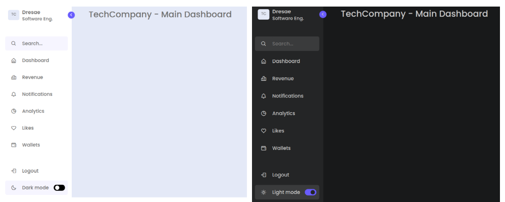

#  :bike: Modern and Responsive Sidebar With Dark Mode 

## :scroll: Overview 
Modern sidebar design integrated with a clean administrative dashboard navigation menu.



***
## :pizza: Page Structure 
    
```
    └── ROOT
        |
        ├── HEAD Section
        │   ├── Meta tags
        │   ├── Links
        │   └── File title
        |
        └── BODY Section
            |
            ├── SIDEBAR container
            |   |
            |   ├── Header section
            |   |   ├── Image/text container
            |   |   └── Toggle
            |   |
            |   ├── Menu container
            |   |   ├── Search box
            |   |   └── Menu icons list
            |   |
            |   └── Bottom_content container
            |       ├── Logout list
            |       └── Dark mode list
            |
            └── HOME Section
            |   └── Title container
            |
            └── SCRIPT

```

***

## :pencil2: Key Takeaways 

### HTML:
The page is formed of two main sections; The SIDEBAR and the HOME section.
- ***SIDEBAR Section***: It was divided into three parts to distribute the header with a logo and user information, a search bar, list of navigation links with icons (Dashboard, Revenue, Notifications, Analytics, Likes, Wallets), a logout link and a dark mode toggle switch at the bottom part.

- ***HOME Section***: This part only stores the main content with the title  "TechCompany - Main Dashboard".

### CSS: 
We used variables (defined in the :root block) to manage colors, spacing, and other visual properties.
1. Following elements were defined:
    - Fixed-position sidebar with a header, menu, and toggle button
    - Main content area (.home) that takes up the remaining space
    - A sticky footer with a logout button and a dark mode toggle

2. Transitions and animations to create smooth interactions
    - Responsive design that adapts to different screen sizes
    - Customizable color scheme using CSS variables
    - Toggle button that switches between light and dark modes

### JS:
 Lastly we added event listeners to three HTML elements:
1. ***.toggle(chevron icon)***: Toggles the close class on the nav element (sidebar) when clicked.
2. ***.search-box***: Removes the close class from the nav element (sidebar) when clicked, effectively opening it.
3. ***.toggle-switch***: Toggles the dark class on the body element when clicked, and updates the text of .mode-text to reflect the current mode ("Light mode" or "Dark mode").


***


***
